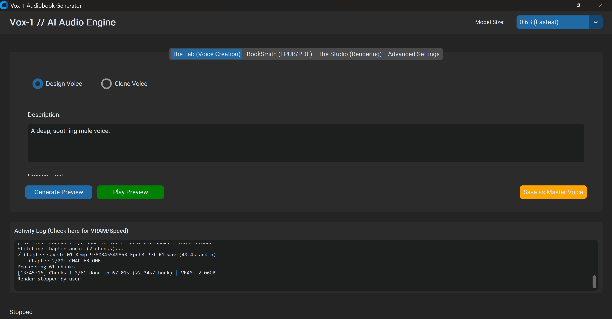

# VOX-1 Audiobook Maker

GPU-accelerated audiobook generator using Qwen3-TTS models. Create professional-quality audiobooks with natural-sounding speech, batch processing, and automatic chapter management.



---

## 🎙️ Audio Samples - Hear It In Action

**Create voices from text descriptions alone** - no audio samples needed!

<table>
<tr>
<td width="33%" align="center">

### 🎬 Atmospheric Sci-Fi
*Deep, gritty male voice*
*Cinematic spaceship captain*

<video src="https://github.com/user-attachments/assets/f8829951-6b19-4ccc-8b18-7793289865a7" controls="controls"></video>

</td>
<td width="33%" align="center">

### 🐉 Classic Fantasy
*Elderly British voice*
*Grandfather storyteller*

<video src="https://github.com/user-attachments/assets/7a57f766-7c95-4e0b-9705-c0a4fcfb828e" controls="controls"></video>

</td>
<td width="33%" align="center">

### 🕵️ Noir Detective
*Smoky 1940s female voice*
*Film noir style*

<video src="https://github.com/user-attachments/assets/93b285e4-3b4a-4457-bcc3-856196b6cde4" controls="controls"></video>

</td>
</tr>
</table>

**[📄 View Full Descriptions & Text →](samples/)**

These voices were created using **Voice Design** - just describe the voice you want, no cloning needed! VOX-1 also supports **Voice Cloning** to copy any voice from a 10-30 second sample.

---

## 🚀 Quick Install (Recommended)

### Step 1: Download Repository
1. Click the green **Code** button at the top of this page
2. Select **Download ZIP**
3. Save to your computer

### Step 2: Extract ZIP
1. Right-click the downloaded ZIP file
2. Select "Extract All..."
3. Extract to where you want VOX-1 installed (e.g., `C:\VOX-1\`)

### Step 3: Run Installer
1. Open the extracted folder
2. Double-click `Install-VOX-1.bat`
3. Wait 10-15 minutes while it downloads everything (~2.5 GB)

### Step 4: Launch
After installation completes:
1. `START_HERE.txt` will open automatically with instructions
2. Double-click `RUN-VOX-1.bat` to start the app
3. Read `USER_GUIDE.md` for complete instructions

That's it! A desktop window will open with the VOX-1 interface.

---

## 📦 What Gets Installed

The installer automatically downloads and sets up:
- ✅ Python 3.10 (embedded, no system install needed)
- ✅ VOX-1 source code
- ✅ FFmpeg (audio processing, from GitHub)
- ✅ PyTorch + CUDA (~2 GB)
- ✅ All Python dependencies

**Installation size:** ~2.7 GB
**Installation time:** 10-15 minutes

### First Run - Additional Downloads

The first time you use each feature, AI models download automatically:
- **Voice Design:** ~3.4 GB (one-time)
- **Voice Cloning:** ~3.4 GB (one-time)
- **Audiobook Generation:** ~1.2 GB (one-time)

**Total storage needed:** ~8-10 GB
**Models cache to:** `Your-Project-Folder/models/` (kept with the app, not in C:\Users\)
**After first run:** Everything loads instantly from cache!

---

## 🔄 Updating VOX-1

### Option 1: Auto-Update (Git Method) - Recommended

If you want automatic updates:

1. **Install Git**: Download from [git-scm.com](https://git-scm.com/download/win)
2. **Clone repository** instead of downloading ZIP:
   ```bash
   git clone https://github.com/marcusau2/VOX-1-Audiobook-Maker.git
   cd VOX-1-Audiobook-Maker
   Install-VOX-1.bat
   ```
3. **Future updates**: Just double-click `UPDATE-VOX-1.bat`

### Option 2: Manual Update (ZIP Method)

If you downloaded as ZIP:

1. **Back up your data** (copy these folders):
   - `Output/` - Your generated audiobooks
   - `VOX-Output/` - Master voices
   - `user_settings.json` - Your settings
   - `models/` - Optional (8GB, saves re-download time)

2. **Download latest ZIP** from GitHub
3. **Extract** to a new location
4. **Copy back** your backed-up folders
5. **Run** `Install-VOX-1.bat` to update dependencies

**Note:** Your audiobooks and settings are never deleted during updates!

---
---

## ⚡ Performance Optimization (Optional)

### Understanding CUDA Graph Performance

**Why is the first generation slow?**

The first time you generate audio with each model type, FasterQwen3TTS captures CUDA graphs for your specific GPU. This is a **one-time optimization** that enables 3-4x real-time performance.

**What to expect:**
- **First generation:** 10-30 seconds (normal - graphs being captured)
- **Second generation:** <1 second (CUDA graphs active!)
- **All subsequent:** <1 second (consistent high speed)

**Tips:**
- Keep the app open - graphs stay cached while VOX-1 runs
- Each model type (Design/Clone/Render) captures separately
- The delay is automatic - no action needed!

**Check status:** Go to Advanced Settings → Look for "⚡ Performance Mode"

---
## 💻 System Requirements

- **OS:** Windows 10/11 64-bit
- **GPU:** NVIDIA with 8GB+ VRAM (12GB recommended)
- **CUDA:** Automatically installed with PyTorch
- **Storage:** ~5 GB free space
- **Internet:** Required for installation only

---

## 🎯 Features

### 🎨 Voice Creation (What Makes VOX-1 Special)
- **🎙️ Voice Design** - Create voices from text descriptions alone
  - Describe tone, accent, age, style
  - No audio samples needed
  - Perfect for unique character voices
- **🎵 Voice Cloning** - Copy any voice from 10-30 seconds of audio
  - Clone narrators, actors, or your own voice
  - Consistent quality across hours of content
  - Professional audiobook production

### ⚡ Performance & Quality
- **High-Quality TTS** - Qwen3-TTS state-of-the-art models (0.6B/1.7B)
- **GPU Accelerated** - CUDA-optimized inference on NVIDIA GPUs
- **Batch Processing** - Process multiple chunks simultaneously
- **VRAM Optimization** - Smart batching + CUDA graph optimization (3-4x real-time speed)

### 📚 Production Features
- **Chapter Support** - Automatic EPUB/PDF chapter detection
- **M4B Export** - Audiobooks with embedded chapter markers
- **Resume Support** - Pick up where you left off
- **Real-time Monitoring** - VRAM usage and progress tracking

---

## 📖 Usage

### Basic Workflow

1. **The Lab Tab** - Create or clone voices
   - Design voice from text description, or
   - Clone from audio sample (10-30s WAV/MP3)
   - Save as Master Voice

2. **BookSmith Tab** - Extract chapters from EPUB/PDF
   - Load EPUB or PDF file
   - Automatically extracts chapters
   - Exports as JSON

3. **Studio Tab** - Generate audiobook
   - Load Master Voice
   - Load book (TXT/JSON)
   - Click "Render Audiobook"
   - Output: MP3 or M4B with chapters

### Performance Settings

Adjust in **Advanced Settings** tab:

**Recommended Starting Points:**
| GPU VRAM | Model Size | Starting Batch Size |
|----------|------------|---------------------|
| 8-10 GB  | 0.6B       | 2                   |
| 12 GB    | 0.6B       | 3                   |
| 16+ GB   | 1.7B       | 3-5                 |

**Tips:**
- Start with recommended batch size
- Monitor VRAM usage in Activity Log
- Increase gradually if VRAM usage is low
- Understand CUDA graph capture (see Performance Optimization section)

---

## 📁 Folder Structure After Install

```
Your-Project-Folder/
├── RUN-VOX-1.bat              # ⭐ DOUBLE-CLICK THIS TO START
├── UPDATE-VOX-1.bat           # ⭐ Check for and install updates
├── START_HERE.txt             # Quick start guide (opens after install)
├── USER_GUIDE.txt             # Complete user manual
├── Launch-Debug.bat           # For troubleshooting
├── Install-VOX-1.bat          # Installer (re-run to fix dependencies)
├── python310/                 # Python environment
├── models/                    # AI models cache (~8-10 GB after first run)
├── app/                       # VOX-1 application
│   ├── app.py                 # Main GUI
│   ├── backend.py             # TTS engine
│   ├── booksmith_module/      # Text processing
│   ├── ComfyUI-Qwen-TTS/      # TTS library
│   ├── ffmpeg_bundle/         # Audio tools
│   ├── Output/                # Generated audio
│   └── VOX-Output/            # Final audiobooks (YOUR FINISHED BOOKS HERE!)
```

---

## 🔧 Troubleshooting

### "CUDA out of memory"
- Reduce batch size in Advanced Settings
- Switch to 0.6B model instead of 1.7B
- Close other GPU applications
- Restart the app

### Slow generation
- Check VRAM usage in activity log
- Increase batch size if VRAM allows
- Try attention mode: "sdpa" (fastest)

### App won't start
- Make sure you have an NVIDIA GPU
- Check GPU drivers are updated
- Run `Launch-VOX-1-Debug.bat` to see error messages

### Installation failed
- Check internet connection
- Run installer again (it will resume)
- Manually download Python from: https://www.python.org/ftp/python/3.10.11/python-3.10.11-embed-amd64.zip

---

## 🔄 Updating VOX-1

To update to the latest version:
1. Run `Install-VOX-1.bat` again
2. Choose "Yes" when asked to re-download
3. Your settings and output files are preserved

---

## 🛠️ Advanced Installation (Developers)

If you want to modify the code or contribute:

```bash
# Clone repository
git clone https://github.com/marcusau2/VOX-1-Audiobook-Maker.git
cd VOX-1-Audiobook-Maker

# Install dependencies
pip install -r requirements.txt

# Run app
python app.py
```

See [MANUAL_INSTALL.md](MANUAL_INSTALL.md) for detailed instructions.

---

## 📚 Documentation

- **README.md** - This file (quick start)
- **FLASH_ATTENTION.md** - Performance optimization guide
- **MANUAL_INSTALL.md** - Advanced installation guide
- **booksmith_module/README.md** - Text processing details

---

## 🐛 Known Issues

- First generation after launch is slower (model loading)
- Very long texts (>50k words) may need multiple sessions
- Some special characters may not render in audio

---

## 🗺️ Roadmap

- [ ] Linux support
- [ ] Real-time preview
- [ ] Multi-language support
- [ ] Cloud GPU integration
- [ ] Plugin system for custom voices

---

## 📄 License

This project is licensed under the Apache License 2.0.

---

## 🙏 Credits

Built with:
- [Qwen3-TTS](https://github.com/QwenLM/Qwen3-TTS)
- [PyTorch](https://pytorch.org/)
- [Gradio](https://gradio.app/)
- [FFmpeg](https://ffmpeg.org/)

---

## 💬 Support

For issues, questions, or feature requests:
- Open an issue on GitHub
- Check existing issues for solutions

---

**Last Updated:** January 2026
